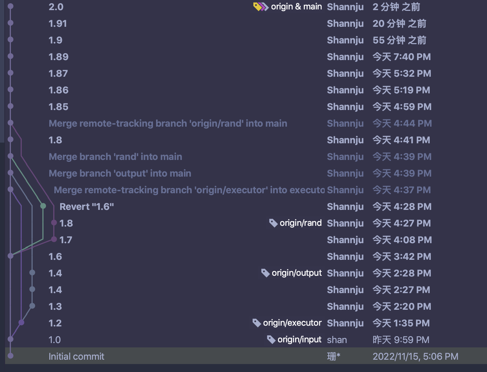
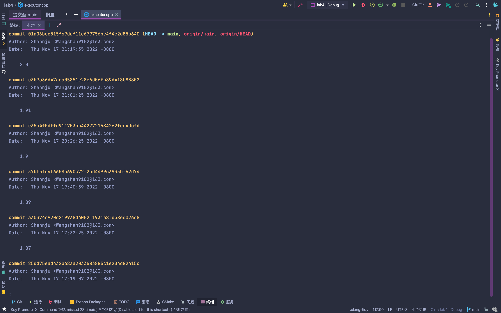
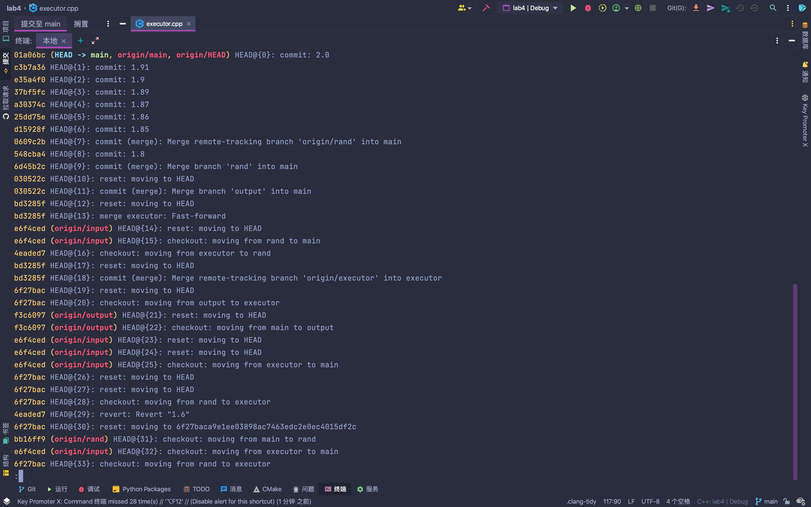
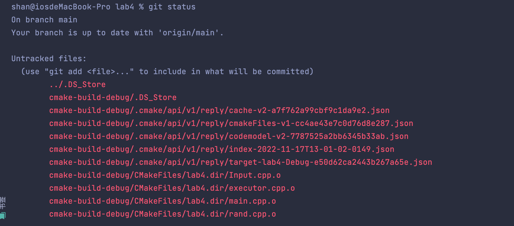

[TOC]


# 实验4：等价判断

## 1. 实验目的

- 编程实现上一次实验中所做的设计

- 体验简易版等价判断和确认工具的工作流程

- 学习常用的git和github使用技巧

## 2. 实验环境

- 操作系统：MacOS
- 实验工具
  - Git
  - Language
    - C++ 
  - IDE 
    - Clion

## 3. 实验内容

分为四个模块：

Input executor output rand

### 3.1 Input

如上次实验的构想，该模块负责输入文件夹的管理。

```cpp
class Input {//管理单个文件夹，
    string format;
    string folderPath;
public:
    string getFormat();//输入格式format的地址
    string getFolderPath();//整个文件夹的地址
    vector<std::string> filenames;//文件夹内文件地址集
    explicit Input(const string &folderPath);
};

class InputFolder {//管理整个input文件夹下的单个文件夹，eg：50A
private:
    string folderPath;
public:
    ~InputFolder() = default;
    vector<Input> ls;
    explicit InputFolder(const string &folderPath);

};
```

### 3.2 output

管理实验结果的输出，在具体实现时，我发现本实验的输出只有equal.csv /inequal.csv。所以output可以简洁化，用两个文件输出对象来完成。

```C++
class output {
    ofstream equal;
    ofstream inequal;
public:
    void add (bool e,string a,string b);//添加条目函数。
};

```

### 3.3 executor

该模块负责oj的测试生成和执行，是程序的核心模块。

#### 3.31 eg

首先构造测试用例，eg类对应的是 stdin_format.txt 中的某一个type。

例如：int(1,2) 调用它的 generate()可以得到属于{1，2}集合中的合法随机样例。

```CPP
enum type {
    Int, Char, String
};

struct eg {
    type t;
    int a, b;
    string generate();
    eg(type t, int a, int b) : t(t), a(a), b(b) {};
};

```

#### 3.32  exeUnit 

 exeUnit 是对于一个文件对（eg： a.cpp b.cpp）进行测试的结构。

```CPP
class exeUnit {
    string f0, f1;
    Input *input;
public:
    exeUnit(const string &f0, const string &f1, Input *input);
    bool test();//执行一次随机tst 返回结果是否一样
};
```

通过内嵌shell语句，execute()和test()将给出的cpp文件编译成可执行文件，并将测试输入给可执行文件，结果写入output1.txt和outpu2.txt

对于这些临时文件，运行中不进行删除，直接覆盖打开， 运行结束统一回收。

```cpp

void execute(string f) {
    string cmd = "g++ " + abspath+f.substr(2) + " -o " + abspath+f.substr(2, f.size() - 6);
    system(cmd.c_str());
    debug("!!execute " +cmd)
}

bool exeUnit::test() {
    execute(f0);
    execute(f1);
    string cmd;
    cmd =  + f0.substr(2, f0.size() - 4) +
          " <" + abspath + "/tstfile.txt " + ">" + abspath +
          "/output0.txt";
    system(cmd.c_str());
    debug("!!cmd " + cmd)
    cmd =  + f1.substr(2, f0.size() - 4) +
          " <" + abspath + "/tstfile.txt " + abspath +
          "/output1.txt";
    system(cmd.c_str());
    ifstream ifs0 = std::ifstream(abspath + "/output0.txt", std::ios::in);
    ifs0.unsetf(ios::skipws);
    if (!ifs0) {
        debug("fail to open0 " + input->getFormat())
        return 0;
    }

    ifstream ifs1 = std::ifstream(abspath + "/output0.txt", std::ios::in);
    ifs1.unsetf(ios::skipws);
    if (!ifs1) {
        debug("fail to open1 " + input->getFormat())
        return 0;
    }

    string s0, s1;
    ifs0 >> s0;
    ifs1 >> s1;
    if (strcmp(s0.c_str(), s1.c_str()) != 0)
        return 0;
    else
        return 1;
    ifs0.close();
    ifs1.close();
}

```

#### 3.33 executor 

对于一个文件夹执行测试。

````C++
//对于一个文件夹执行测试
class executor {
    Input *input;//输入对象
    vector<string> ls;//cpp集合
    vector<eg> egList;//每个oj有多个输入，组成一个eglist，遍历、拼接，即可生成完整测试样例
    string tstfile;//生成测试用例路径
    output * o;
public:
    void makeList();//初始化eglist
    string makeTst();//生成测试用例内容
    void refreshTst();//刷新测试文件内容
    void testA();//对C（2，n）个文件执行测试
    executor(Input *input, output *o);
    bool manyTst(exeUnit e); // 对于一个文件对，进行多次测试，返回是否等价
};
````

对于给定的stdin_format.txt：

```
int(1,16) int(1,16)
```

测试结果如下

```
2，10
```

在testAll中，对C（2，n）个文件进行测试，结果通过output指针输出。

至此核心功能完成。

### 3.4 rand

辅助随机样例生成。

```cpp
string randInt(int a, int b);	//生成（a,b)间的int
char randChar(); //生成随机char
string randString(int a, int b);//生成（a,b)长度的string
```

## 4. 实验结果

equal.csv：

```
file1,file2
input/50A/30534178.cpp,input/50A/138805414.cpp
input/50A/30534178.cpp,input/50A/21508898.cpp
input/50A/30534178.cpp,input/50A/21508887.cpp
input/50A/30534178.cpp,input/50A/142890373.cpp
input/50A/31034693.cpp,input/50A/36641065.cpp
input/50A/31034693.cpp,input/50A/33794240.cpp
input/50A/31034693.cpp,input/50A/29019948.cpp
input/50A/31034693.cpp,input/50A/21715601.cpp
input/50A/31034693.cpp,input/50A/164831265.cpp
input/50A/138805414.cpp,input/50A/21508898.cpp
input/50A/138805414.cpp,input/50A/21508887.cpp
input/50A/138805414.cpp,input/50A/142890373.cpp
input/50A/36641065.cpp,input/50A/33794240.cpp
input/50A/36641065.cpp,input/50A/29019948.cpp
input/50A/36641065.cpp,input/50A/21715601.cpp
input/50A/36641065.cpp,input/50A/164831265.cpp
input/50A/21508898.cpp,input/50A/21508887.cpp
input/50A/21508898.cpp,input/50A/142890373.cpp
input/50A/33794240.cpp,input/50A/29019948.cpp
input/50A/33794240.cpp,input/50A/21715601.cpp
input/50A/33794240.cpp,input/50A/164831265.cpp
input/50A/21508887.cpp,input/50A/142890373.cpp
input/50A/29019948.cpp,input/50A/21715601.cpp
input/50A/29019948.cpp,input/50A/164831265.cpp
input/50A/21715601.cpp,input/50A/164831265.cpp
input/4A/127473352.cpp,input/4A/134841308.cpp
input/4A/173077807.cpp,input/4A/84822639.cpp
input/4A/173077807.cpp,input/4A/84822638.cpp
input/4A/84822639.cpp,input/4A/84822638.cpp

```

inequal.csv：

```
file1,file2
input/50A/30534178.cpp,input/50A/31034693.cpp
input/50A/30534178.cpp,input/50A/36641065.cpp
input/50A/30534178.cpp,input/50A/45851050.cpp
input/50A/30534178.cpp,input/50A/33794240.cpp
input/50A/30534178.cpp,input/50A/29019948.cpp
input/50A/30534178.cpp,input/50A/21715601.cpp
input/50A/30534178.cpp,input/50A/164831265.cpp
input/50A/31034693.cpp,input/50A/138805414.cpp
input/50A/31034693.cpp,input/50A/21508898.cpp
input/50A/31034693.cpp,input/50A/45851050.cpp
input/50A/31034693.cpp,input/50A/21508887.cpp
input/50A/31034693.cpp,input/50A/142890373.cpp
input/50A/138805414.cpp,input/50A/36641065.cpp
input/50A/138805414.cpp,input/50A/45851050.cpp
input/50A/138805414.cpp,input/50A/33794240.cpp
input/50A/138805414.cpp,input/50A/29019948.cpp
input/50A/138805414.cpp,input/50A/21715601.cpp
input/50A/138805414.cpp,input/50A/164831265.cpp
input/50A/36641065.cpp,input/50A/21508898.cpp
input/50A/36641065.cpp,input/50A/45851050.cpp
input/50A/36641065.cpp,input/50A/21508887.cpp
input/50A/36641065.cpp,input/50A/142890373.cpp
input/50A/21508898.cpp,input/50A/45851050.cpp
input/50A/21508898.cpp,input/50A/33794240.cpp
input/50A/21508898.cpp,input/50A/29019948.cpp
input/50A/21508898.cpp,input/50A/21715601.cpp
input/50A/21508898.cpp,input/50A/164831265.cpp
input/50A/45851050.cpp,input/50A/33794240.cpp
input/50A/45851050.cpp,input/50A/21508887.cpp
input/50A/45851050.cpp,input/50A/29019948.cpp
input/50A/45851050.cpp,input/50A/142890373.cpp
input/50A/45851050.cpp,input/50A/21715601.cpp
input/50A/45851050.cpp,input/50A/164831265.cpp
input/50A/33794240.cpp,input/50A/21508887.cpp
input/50A/33794240.cpp,input/50A/142890373.cpp
input/50A/21508887.cpp,input/50A/29019948.cpp
input/50A/21508887.cpp,input/50A/21715601.cpp
input/50A/21508887.cpp,input/50A/164831265.cpp
input/50A/29019948.cpp,input/50A/142890373.cpp
input/50A/142890373.cpp,input/50A/21715601.cpp
input/50A/142890373.cpp,input/50A/164831265.cpp
input/4A/117364748.cpp,input/4A/48762087.cpp
input/4A/117364748.cpp,input/4A/127473352.cpp
input/4A/117364748.cpp,input/4A/173077807.cpp
input/4A/117364748.cpp,input/4A/84822639.cpp
input/4A/117364748.cpp,input/4A/134841308.cpp
input/4A/117364748.cpp,input/4A/84822638.cpp
input/4A/117364748.cpp,input/4A/101036360.cpp
input/4A/48762087.cpp,input/4A/127473352.cpp
input/4A/48762087.cpp,input/4A/173077807.cpp
input/4A/48762087.cpp,input/4A/84822639.cpp
input/4A/48762087.cpp,input/4A/134841308.cpp
input/4A/48762087.cpp,input/4A/84822638.cpp
input/4A/48762087.cpp,input/4A/101036360.cpp
input/4A/127473352.cpp,input/4A/173077807.cpp
input/4A/127473352.cpp,input/4A/84822639.cpp
input/4A/127473352.cpp,input/4A/84822638.cpp
input/4A/127473352.cpp,input/4A/101036360.cpp
input/4A/173077807.cpp,input/4A/134841308.cpp
input/4A/173077807.cpp,input/4A/101036360.cpp
input/4A/84822639.cpp,input/4A/134841308.cpp
input/4A/84822639.cpp,input/4A/101036360.cpp
input/4A/134841308.cpp,input/4A/84822638.cpp
input/4A/134841308.cpp,input/4A/101036360.cpp
input/4A/84822638.cpp,input/4A/101036360.cpp

```

## 5. 版本控制 

使用Ide提供的git进行管理。

对于四个模块，采用四个分支进行管理，分支名同模块名称。

合并分支：

```
git switch main
git merge input
```



中间使用了`git reset --hard `回退，却因此丢失了部分代码。

git log查看上一次commit的版本号：




使用git reflog查看历史git记录




git status



## 6. 扩展

远端仓库https://github.com/Shannju/NJUcs-Software-Engineering-Lab

